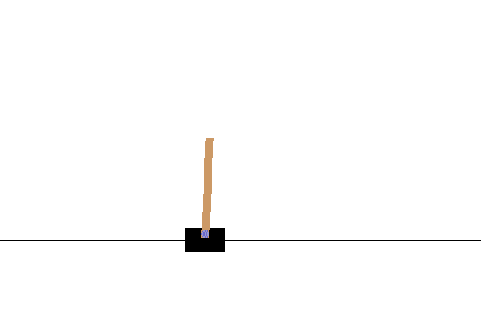

# Playing CartPole with Actor-Critic Method

Agent trained on [Open AI Gym](https://gym.openai.com/) CartPole-V0 environment using Actor-Critic method.

We build the Actor and Critic using a neural netowrk that outputs action probabilities and critic values (2 outputs),
which takes as input the current state. The model aims to choose actions based on a policy pi that maximizes the expected return.
In Carpole-v0, there are four values representing the state: cart position, cart-velocity, pole angle and pole velocity. The agent can take two actions to push the cart: push the cart left (0) or push the cart right (1).

After training our model, we acheive an agent that can successfully balance the pole on the cart consistently for at least 200 time units:

